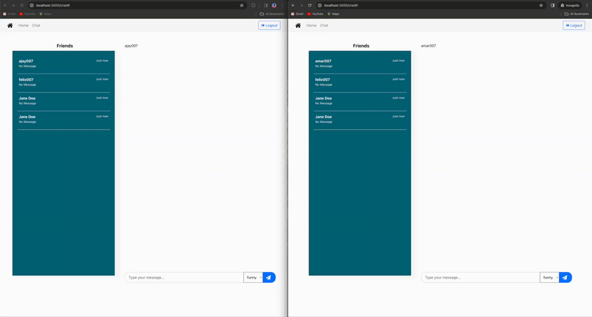

# Weirdly Wired Chat

🤯 Ever had work frustrations but needed to keep it polite? Introducing Weirdly Wired Chat! Vent professionally or go wild with friends in street talk mode. 😂 Plus, the code's open for tech geeks! Explore ReactJS, TypeScript, Django Rest, and more. And guess what? It's powered by Google Gemini too! Dive in! #WeirdlyWiredChat 🚀

## Why?

It's just a funny project came to my mind, just trying to convert that idea into reality.

## Demo

Funny mode to try with friends 🤐.

Polite mode to try with colleagues 😂.

- Currently, we are using google's gemini API for text to speech conversion.
- The idea is to do it via open-source fine tuned LLM Calls with different personas.

## Backend

Backend code at [link](https://github.com/aj-jaiswal007/WeirdlyWired.CoreAPIs)
